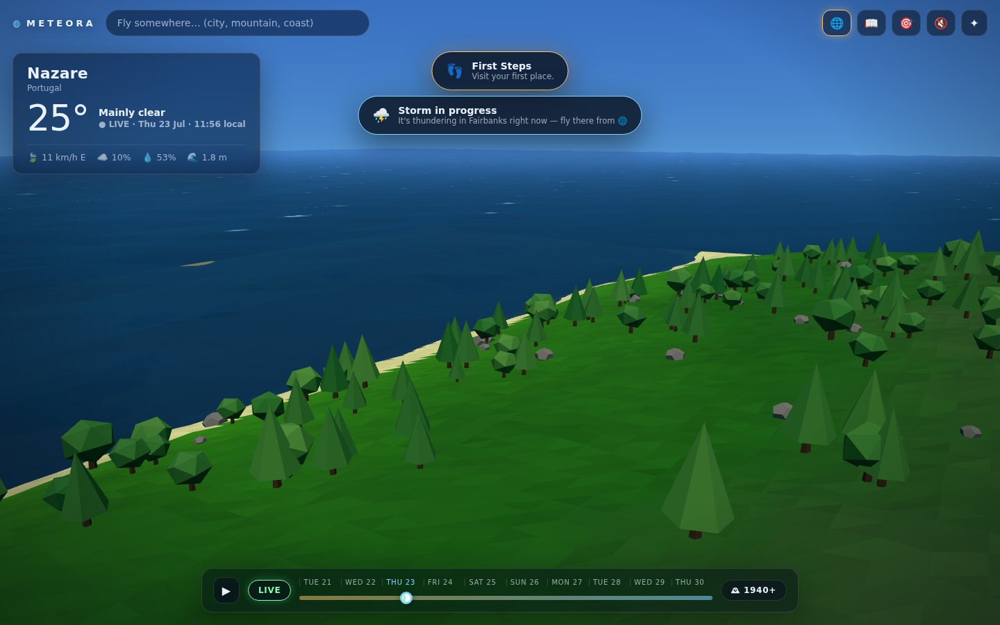
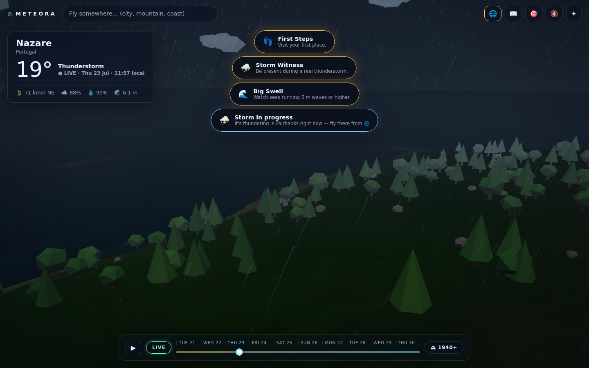
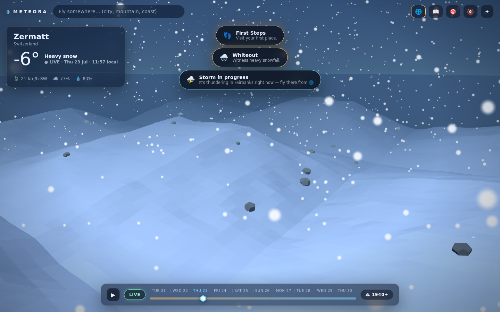
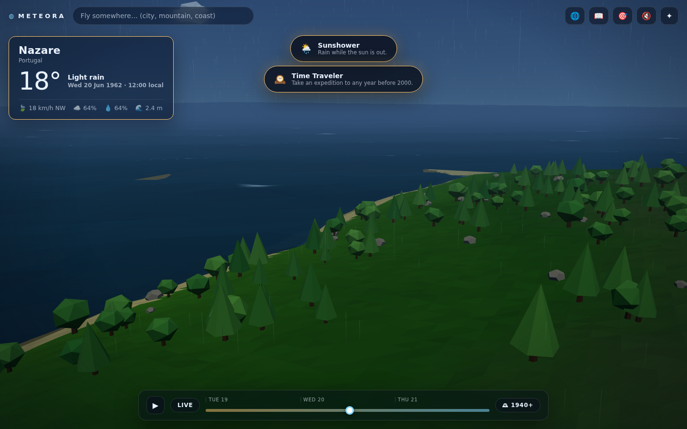

# 🌍 Meteora — a real-weather world

**Explore Earth's actual weather as a living, animated low-poly world.**
Nothing is faked: the sun sits where it truly sits for that place and moment, real wind
bends the trees and slants the rain, real cloud cover fills the sky, real wave height
moves the sea — and a time machine scrubs from **1940** to **16 days into the future**.

Powered end-to-end by [Open-Meteo](https://open-meteo.com/): no API key, no backend,
no build step. One static folder.

| Live coast | Real thunderstorm | Alpine whiteout |
|---|---|---|
|  |  |  |

## What it is

- **A terrain-aware diorama.** Search anywhere. A 9×9 grid of real ground elevations
  (Open-Meteo elevation API) sets the bones of a procedural low-poly scene; the marine API
  decides whether a living sea laps at it; latitude and the local climate pick the biome
  palette and vegetation. Every location looks like *itself*.
- **Weather that is honest.** Sun and moon positions are computed astronomically for the
  place and moment you're viewing. Cloud cover, precipitation, fog, snow cover, wind sway,
  wave height, storm light and lightning are all driven by the actual data — the scene
  never shows weather that isn't (or wasn't) happening.
- **A time machine.** The scrub bar covers ten days around now, interpolated hourly.
  The 🕰 button opens an expedition to any date since 1940 via the historical archive —
  watch a 1962 rainstorm fall on Nazaré.

  
- **📖 Logbook.** Seventeen achievements for weather you *witness*: stand in a live
  thunderstorm, find −30 °C, catch 5 m seas, see the midnight sun. Sightings reached
  through the time machine are honestly badged "via time machine".
- **🎯 Forecast duel.** Call tomorrow's high anywhere on Earth. The model's forecast is
  locked in at the same moment; the recorded actual settles the duel the next day.
  Streaks tracked. Beat the supercomputer.
- **🌐 World right now.** One batched call across ~36 places surfaces the live extremes —
  hottest, coldest, windiest, and every storm in progress — so hunting achievements is
  discovery, not tedium.
- **📍 Your own location.** One tap drops you exactly where you are. Works in the browser
  and in the Android app (which asks for the OS location permission the first time).
  The weather always comes from your raw coordinates; the place *name* uses
  [BigDataCloud](https://www.bigdatacloud.com/)'s free keyless reverse-geocode endpoint,
  since Open-Meteo's geocoding is forward-only. If that lookup is unavailable the app
  shows "Your location" with coordinates rather than guessing a city.
- **Procedural sound.** Wind, rain and distance-delayed thunder are synthesized in
  WebAudio from the same data. 🔇/🔊 toggle in the top bar.
- **✨ Optional AI (Groq).** Bring your own key and two things switch on: a two-sentence
  **field dispatch** describing what you're standing in on arrival, and
  **natural-language travel** — type *"somewhere it's snowing right now"* and the model
  picks a real destination using the live world sample. Both are grounded in the same
  Open-Meteo numbers the world is built from: the model narrates and chooses, it never
  invents weather. Everything else works exactly the same without a key.

## Run it

Any static file server works (ES modules need HTTP, not `file://`):

```bash
python3 -m http.server 8000
# → http://localhost:8000
```

Deploying is the same story: GitHub Pages, Netlify, Cloudflare Pages — point at the repo
root, done. There is no build step; `three.js` is vendored in `vendor/`.

## Run it on Android

The repo includes a native shell in [`android/`](android/):

1. Open the **`android/`** folder in Android Studio (File → Open — pick `android/`,
   not the repo root).
2. Let Gradle sync (the wrapper is committed; first sync downloads Gradle 8.7 + AGP).
3. Select your connected phone and press **Run ▶**.

The shell is a single-activity WebView served through `WebViewAssetLoader`, so ES
modules, `fetch()` to Open-Meteo and `localStorage` behave exactly like a browser.
The web app at the repo root is copied into the APK's assets automatically on every
build — edit `js/`/`css/` and just re-run. Debug builds enable WebView inspection:
plug in the phone and open `chrome://inspect` on the laptop to get full DevTools.

(For a quick look without Android Studio: `python3 -m http.server 8000` on the laptop,
then visit `http://<laptop-ip>:8000` from the phone's browser on the same Wi-Fi.)

## Optional: connecting Groq

AI features are dormant until you add a key — the app never ships one and has no server
to hold one.

1. Get a free key at [console.groq.com/keys](https://console.groq.com/keys).
2. Open the **✨** panel in the app, paste it, press **Save**.

The key is stored in your browser's `localStorage` and sent only to Groq's API — never to
this site (there is nothing to send it to) and never to Open-Meteo. Clear it any time from
the same panel. Model is switchable between Llama 3.3 70B (better writing) and 3.1 8B
(faster).

Because the call goes straight from the page to `api.groq.com`, it depends on Groq
permitting browser-origin requests. If your browser blocks it as a cross-origin request,
the app says so plainly and everything else keeps working; the fix in that case is to put
a small proxy in front of Groq, which trades away the "static, no backend" property.

## How it holds up under traffic

Everything runs in the visitor's browser against Open-Meteo's public, keyless APIs
(free for non-commercial use, [fair-use policy](https://open-meteo.com/en/terms)).
The site itself is static files — there is nothing to scale.

## Architecture

```
index.html            shell + importmap (three.js from vendor/)
css/style.css         glass-and-glow UI chrome
js/
  main.js             app state, time machine, search, panels, boot
  api.js              Open-Meteo clients: forecast, archive, marine, elevation, geocoding
  geo.js              device geolocation + timezone-derived place naming
  ai.js               optional Groq client: field dispatch, natural-language travel
  solar.js            astronomical sun/moon position (the sky never lies)
  palette.js          WMO code semantics + the one place that owns all color grading
  audio.js            procedural WebAudio wind/rain/thunder
  logbook.js          achievements (localStorage)
  duel.js             forecast duel + resolution against recorded actuals (localStorage)
  worldnow.js         batched live-extremes sampler
  scene/
    world.js          renderer, camera, lights, frame loop
    sky.js            gradient dome shader, sun/moon, stars, drifting cloud fleet
    terrain.js        procedural diorama: elevation grid → heightfield → biome-painted
                      low-poly mesh, sea with real waves, instanced trees/rocks,
                      dynamic snow line and rain-wet ground via shader uniforms
    effects.js        GPU rain/snow particles, lightning strikes
```

Data flow is one-directional and per-frame: *timeline hour (interpolated) → conditions →
solar position → color grade → uniforms*. The 3D world is a pure function of real data
and time.

## Credits

- Weather, marine, geocoding and elevation data by [Open-Meteo.com](https://open-meteo.com/),
  licensed [CC BY 4.0](https://creativecommons.org/licenses/by/4.0/).
- Rendering: [three.js](https://threejs.org/) (MIT, vendored — license in `vendor/THREE-LICENSE.txt`).
- No tracking, no accounts; your logbook and duels live in your own browser.
